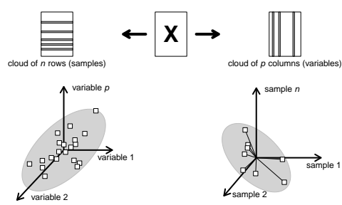

```{r setup, include=FALSE}
options(htmltools.dir.version = FALSE)
knitr::opts_chunk$set(tidy=TRUE, tidy.opts=list(width.cutoff=50), fig.height= 4, fig.width=4, dev='svg', fig.align="center", fig.path = "fig/")
```

```{r xaringan-themer, include=FALSE}
library(xaringanthemer)
style_duo(primary_color = "#1F4257", secondary_color = "#F97B64", table_row_even_background_color = "#1F4257")
```

---
class: center, inverse

# Introduction

---

## Multivariate data 

We consider cases where several variables are measured for a number of individuals 

.pull-left[
```{r, echo = FALSE}
knitr::include_graphics("img/onetable.png")
```
]

.pull-right[
$n$ statistical units x $p$ variables

Examples in ecology

* individuals x traits
* species x traits
* sites x species
* sites x environment

]

```{r}
library(ade4)
data(doubs)
names(doubs$env)
```

---
## Univariate analysis

.pull-left[
```{r}
summary(doubs$env$slo)
mean(doubs$env$slo)
var(doubs$env$slo)
```
]

.pull-right[
```{r}
hist(doubs$env$slo)
```
]

---
## Bivariate analysis

.pull-left[
```{r}
cov(doubs$env$slo, doubs$env$nit)
cor(doubs$env$slo, doubs$env$nit)
```
]

.pull-right[
```{r}
plot(doubs$env$slo, doubs$env$nit)
```
]
---
## Pairwise analysis

```{r, fig.width=9, fig.height=6}
pairs(doubs$env)
```
---
## Pairwise analysis

```{r}
round(cor(doubs$env), 2)
```
---
## Multivariate analysis

Avoid pairwise analysis to provide a global summary of the full data set. The objective is to answer simultaneously both questions:


- what are the main similarities and differences between the individuals ?
- what are the main relationships between the variables ?

Multivariate analysis allows to:
- summarize linear relationships between variables
- identify structures among individuals
- reduce the number of variables before new analyses
- replace original variables by new synthetic ones

---
class: center, inverse

# Geometric perspective

---
# Two geometric views

```{r, echo = FALSE}

```
.pull-left[
In $\mathbb{R}^p$, what are the main similarities and differences between the individuals ?
]

.pull-right[
In $\mathbb{R}^n$, what are the main relationships between the variables ?
]
---
## A 3D example (space of individuals)

```{r rgl-plot, include = FALSE}
library(rgl)
knitr::knit_hooks$set(webgl = hook_webgl)
```

.pull-left[
```{r}
tab <- doubs$env[,c(3,8,10)]
color <- rainbow(30)
pairs(tab, col = color)
```
]


.pull-right[
```{r plot-sim, eval=FALSE}
source("../../R/3D-utils.R")
plot3d(tab, type = "s", col = color)
```

```{r plot-sim-out, message = FALSE, ref.label="plot-sim", echo=FALSE, fig.dim=c(4, 4), webgl=TRUE}
```
]

---

## Change the viewpoint

```{r, echo = FALSE}

```

---

## Change the viewpoint


```{r plot-sim-out, message = FALSE, ref.label="plot-sim", echo=FALSE, fig.dim=c(6, 6), webgl=TRUE}
```

.center[
What is the best viewpoint?
]
---
## Scale the data

```{r, echo = FALSE, webgl = TRUE, fig.dim=c(6, 6)}
clear3d()
tab.sc <- scale(tab, center = TRUE, scale = TRUE)
myplot3d(tab.sc, colpoints = color, colaxes = 'black')
```
---
## Axes of main variation

Axes of main variations describe directions where the projections of individuals are the most scattered

```{r, echo = FALSE, webgl = TRUE, fig.dim=c(6, 6)}
clear3d()
pca <- dudi.pca(tab, nf = 3, scannf = FALSE) 
myplot3d(tab.sc, colpoints = color, colaxes = 'black')
addvar3d(t(pca$c1), col = 'red')
## first PCA axis
for(i in 1:nrow(pca$tab))
  segments3d(rbind(pca$c1[,1] * pca$li[i,1], tab.sc[i,]), col = color[i], lty = 3)
```
---
## New system of axes

Lastly, we can use the principal axes as a new system of coordinates and represent the data in this new system

```{r, echo = FALSE, webgl = TRUE, fig.dim=c(6, 6)}
clear3d()
myplot3d(pca$li, colpoints = color, colaxes = 'black')
addvar3d((pca$c1), col = 'red')
```

---
## Dimension reduction

Only the first few axes (axes of main variation) can be used to describe the main structures of the data. Very useful when a big number of variables/individuals are considered.

```{r}
s.label(pca$li)
```

---
## Space of variables

The same approach can be used to search for the best representation of variables. 

.pull-left[
```{r, echo = FALSE, webgl = TRUE, fig.dim=c(4, 4)}
clear3d()
tab2 <- doubs$env[c(1,11,27),]
tab2.sc <- t(scale(doubs$env[c(1,11,27),]))
color.var <- rainbow(11)
myplot3d2(tab2.sc, colarrows = color.var, colaxes = 'black')

## add PCA axes
pca2 <- dudi.pca(tab2, nf = 3, scannf = FALSE) 
addvar3d(t(pca2$l1), col = 'red')
```
]

.pull-right[
```{r, echo = FALSE}
s.arrow(pca2$li)
```
]
---
## Multivariate analysis in short

- Data transformation (e.g., centering, scaling)
- Best viewpoint (rotation, projection)
- Summarize (dimension reduction)

Multivariate methods seek for small dimension hyperspaces (few axes) where the representations of individuals and variables are as close as possible to the original ones.

To achieve these goals, we need to define some ways to compute distances:

  * $\mb{Q}$, a $p \times p$ positive symmetric matrix, used as an inner product in $\mathbb{R}^p$ and thus allows to measure distances between the $n$ individuals
  * $\mb{D}$,  a $n \times n$ positive symmetric matrix, used as an inner product in $\mathbb{R}^n$ and thus allows to measure relationships between the $p$ variables.


All methods consider these different steps but differ in the transformation of the data ( $\mb{X}$ ), metrics ( $\mb{Q}$ and $\mb{D}$ )  and thus on the mathematical criteria that are maximized

---
class: center, inverse

# Principal component analysis

---
## Data 

- PCA can be applied when the data table contains only quantitative variables

- Data are usually centered and can be scaled

- Two metrics (scalar products) are defined to compute distances in the spaces of variables and individuals

  * $\mb{Q} = \mb{I}_p$ allows to measure distances between the $n$ individuals in $\mathbb{R}^p$.
  * $\mb{D} = \frac{1}{n} \mb{I}_n$ allows to measure relationships between the $p$ variables in $\mathbb{R}^n$.

---
## From geometry to statistics
Several geometric operations translate into statistical concepts:

* the mean is computed by a scalar product and corresponds to a Euclidean projection

$$\textrm{m}(\mathbf{x})= \left\langle \mathbf{x}|\mathbf{1}_n\right\rangle_{\frac{1}{n}\mathbf{I}_n}$$

* the variance is equal to the squared norm of the centred vector $\mathbf{x}^*$

$$\textrm{var}(\mathbf{x})= \sqnorm{\mathbf{x} - \textrm{m}(\mathbf{x}) \mathbf{1}_n}{\frac{1}{n}\mathbf{I}_n}  = \sqnorm{\mathbf{x}^*}{\frac{1}{n}\mathbf{I}_n}$$
* the covariance is a scalar product between two centred vectors
$$\textrm{cov}(\mathbf{x},\mathbf{y})=\left\langle \mathbf{x}^*|\mathbf{y}^*\right\rangle_{\frac{1}{n}\mathbf{I}_n}= \norm{\mathbf{x}}{\frac{1}{n}\mathbf{I}_n} \norm{\mathbf{y}}{\frac{1}{n}\mathbf{I}_n} \cos(\theta_{\mathbf{xy}})$$
* the correlation is a cosine of the angle formed by the two vectors
$$\textrm{cor}(\mathbf{x},\mathbf{y}) = \cos(\theta_{\mathbf{xy}})$$


---
## Geometry for individuals

```{r, fig.width = 9, fig.height=3, echo = FALSE, message = FALSE}
require(MASS)
require(ade4)
set.seed(123)
x <- mvrnorm(30, mu = c(0,0), Sigma = matrix(c(3,2,2,5), 2, 2))  
x = scale(x)
pcX <- dudi.pca(x, scannf = F)  
transformed <- pcX$li[,1] %*% t( pcX$c1[,1] )  

rot = pcX$c1
par(mfrow=c(1,3))
plot(x, asp = 1, xlab = 'x1', ylab = 'x2',  pch = 21, bg = 'grey')
plot(x, asp = 1, xlab = 'x1', ylab = 'x2', type ='n')
# plot rotated axes:
abline(0,rot[2,1]/rot[1,1], col="red", lwd=2)    # first PCA axis, largest variance
#abline(0,rot[2,2]/rot[1,2], col="blue", lwd=2)   # second PCA axis, smallest variance
transf <- pcX$li[,1] %*% t( pcX$c1[,1] )
segments(x[,1], x[,2], transf[,1], transf[,2], col = 'red', lty = 3)
transf <- pcX$li[,2] %*% t( pcX$c1[,2] )
#segments(x[,1], x[,2], transf[,1], transf[,2], col = 'blue', lty = 3)
points(x, pch = 21, bg = 'grey')

plot(x, asp = 1, xlab = 'x1', ylab = 'x2', type ='n')
# plot rotated axes:
abline(0,rot[2,1]/rot[1,1], col="red", lty=3)    # first PCA axis, largest variance
#abline(0,rot[2,2]/rot[1,2], col="blue", lwd=2)   # second PCA axis, smallest variance
arrows(0,0, 1, rot[2,1]/rot[1,1], col="red", lwd=2, length = 0.1) 

transf <- pcX$li[,1] %*% t( pcX$c1[,1] )
segments(x[6,1], x[6,2], transf[6,1], transf[6,2], lty = 3)
arrows(0,0, x[6,1], x[6,2], lwd = 2, length = 0.1)
transf <- pcX$li[,2] %*% t( pcX$c1[,2] )
#segments(x[,1], x[,2], transf[,1], transf[,2], col = 'blue', lty = 3)

text(x[6,1]/2, x[6,2]/2, expression(X[i]), cex = 2, pos = 2)
text(1/2, rot[2,1]/rot[1,1]/2, "a", col = 'red', pos = 1, cex = 2)
points(x, cex = 0.5)
points(x[6,, drop = FALSE], pch = 21, bg = 'grey')
```

We aim to find a vector $\mb{a}$ of $\mathbb{R}^p$ maximizing the sum of the norms of the projections of the rows of $\mb{X}$: 

$$\sum_{i=1}^n d_i \sqnorm{\mb{P}_{\mb{a}} \mb{X}_i}{\mb{Q}}$$
where $d_i$ is the $i$-th diagonal element of $\mathbf{D}$ and $\mathbf{P}_{\mb{a}}$ is the projection operator onto the vector $\mb{a}$
---
## Projection on a (normed) vector

The projection step is obtained by 

$$\mathbf{P}_{\mb{a}} \mathbf{X}_i = \frac{ \left \langle \mathbf{a}|\mathbf{X}_i \right \rangle_{\mb{Q}} }{ \left \langle \mathbf{a} | \mathbf{a} \right \rangle_{\mb{Q}} } \mathbf{a}$$

If $\mathbf{a}$ is $\mathbf{Q}$-normed ( $\mb{a}\tr\mb{Qa}=1$ ), it simplifies to 

$$\mathbf{P}_{\mb{a}} \mathbf{X}_i = \left \langle \mathbf{a}|\mathbf{X}_i \right \rangle_{\mb{Q}}  \mathbf{a}$$
So that the maximized quantity can be rewritten as:

$$\sum_{i=1}^n d_i \sqnorm{ \mb{P}_{\mb{a}} \mb{X}_i}{\mb{Q}} = {\sum_{i=1}^n d_i \left \langle \mathbf{a}|\mathbf{X}_i \right \rangle^2_{\mb{Q}}} = \sqnorm{\mb{XQa}}{\mb{D}} = \textrm{var}(\mb{XQa})$$
---
## Diagonalization

We denote $\lambda$ as the maximum possible value: 

$$\lambda = \sqnorm{\mb{XQa}}{\mb{D}} = \mb{a}\tr\mb{QX}\tr\mb{DXQa}$$
As $\mb{a}$ is $\mb{Q}$-normed, we can write:

$$(\mb{a}\tr\mb{Qa}) \lambda = \mb{a}\tr\mb{QX}\tr\mb{DXQa}$$
and it follows that:

$$\lambda \mb{a} = \mb{X}\tr\mb{DXQa}$$
This corresponds to matrix diagonalization.

Hence, the best axis can be identified as the eigenvector ( $\mb{a}$ ) associated to the highest eigenvalue ( $\lambda$ ) of $\mb{X}\tr\mb{DXQ}$

Other axes can be obtained and correspond to the next eigenvectors/eigenvalues. They maximize the same quantity but should be orthogonal to the previous ones.
---
## PCA in the space of individuals

As $\mb{D} = \frac{1}{n} \mb{I}_n$ and $\mb{Q} = \mb{I}_p$, we have:

$$\lambda \mb{a} = \frac{1}{n}\mb{X}\tr\mb{Xa}$$
* If data have been centered, this corresponds to the diagonalization of the covariance matrix.

* If data have been centered and scaled, this corresponds to the diagonalization of the correlation matrix.

* In both cases, we have the following interpretations:
  - geometric: PCA seeks for an axis ( $\mb{a}$ ), called the **principal axis**, on which individuals are projected ( $\mb{XQa}$ ) so that the points are the most scattered ( $\sqnorm{\mb{XQa}}{\mb{D}}$ ).
  - statistical: PCA seeks for coefficients for variables ( $\mb{a}$ ) to compute a score for individuals ( $\mb{XQa}$ ) with maximal variance ( $\textrm{var}(\mb{XQa})$ ).

---
## Summary

```{r, echo = FALSE, fig.width = 9, fig.height = 3}
require(MASS)
require(ade4)
set.seed(123)
x <- mvrnorm(30, mu = c(0,0), Sigma = matrix(c(3,2,2,5), 2, 2))  
x = scale(x)
pcX <- dudi.pca(x, scannf = F)  
transformed <- pcX$li[,1] %*% t( pcX$c1[,1] )  

rot = pcX$c1
par(mfrow=c(1,3))
plot(x, asp = 1, main="Scatterplot of the data", xlab = 'x1', ylab = 'x2',  pch = 21, bg = 'grey')
plot(x, asp = 1, main="Scatterplot of the data", xlab = 'x1', ylab = 'x2', type ='n')
# plot rotated axes:
abline(0,rot[2,1]/rot[1,1], col="red", lwd=2)    # first PCA axis, largest variance
abline(0,rot[2,2]/rot[1,2], col="blue", lwd=2)   # second PCA axis, smallest variance

transf <- pcX$li[,1] %*% t( pcX$c1[,1] )
segments(x[,1], x[,2], transf[,1], transf[,2], col = 'red', lty = 3)
transf <- pcX$li[,2] %*% t( pcX$c1[,2] )
segments(x[,1], x[,2], transf[,1], transf[,2], col = 'blue', lty = 3)
points(x, pch = 21, bg = 'grey')


plot(pcX$li, asp = 1, main="Rotated scatterplot", xlab = 'Principal axis 1', ylab = 'Principal axis 2')
abline(h=0, col="red", lwd=2)
abline(v=0, col="blue", lwd=2)
points(pcX$li, pch = 21, bg = 'grey')
arrows(0,0,rot[1,1], rot[1,2], length = 0.15)
arrows(0,0,rot[2,1], rot[2,2], length = 0.15)
text(rot[1,1], rot[1,2], "x1", pos = 1, offset = 0.1)
text(rot[2,1], rot[2,2], "x2", pos = 3, offset = 0.1)


```

The last plot corresponds to the PCA factorial map and is usually called a **distance biplot** as it best preserves the distances between individuals.

- individuals are represented by $\mb{XQa}$
- variables are represented by $\mb{a}$
- if more variables (here 2) are considered, only the first few axes can be kept so that dimension reduction is performed. The first axes preserves the most important part of information (maximized projected inertia/variance). 
---
## Space of variables

In $\mathbb{R}^n$, we can follow the same rationale for variables than for individuals in $\mathbb{R}^p$.

```{r, echo = FALSE, fig.width = 9, fig.height = 4.5}
require(MASS)
require(ade4)
set.seed(123)
x <- mvrnorm(10, mu = c(0,0), Sigma = matrix(c(3,2,2,5), 2, 2))  
x = scale(x)
pcX <- dudi.pca(x, scannf = F)  
transformed <- pcX$li[,1] %*% t( pcX$c1[,1] )  

rot = pcX$c1
par(mfrow=c(1,2))
plot(x, asp = 1, main="Scatterplot of the data", xlab = 'ind1', ylab = 'ind2', type ='n')
arrows(rep(0, 10), rep(0, 10), x[,1], x[,2], length = 0.1)
plot(x, asp = 1, main="Scatterplot of the data", xlab = 'ind1', ylab = 'ind2', type ='n')
arrows(rep(0, 10), rep(0, 10), x[,1], x[,2], length = 0.1)
# plot rotated axes:
abline(0,rot[2,1]/rot[1,1], col="green", lwd=2)    # first PCA axis, largest variance
abline(0,rot[2,2]/rot[1,2], col="orange", lwd=2)   # second PCA axis, smallest variance

transf <- pcX$li[,1] %*% t( pcX$c1[,1] )
segments(x[,1], x[,2], transf[,1], transf[,2], col = 'green', lty = 3)
transf <- pcX$li[,2] %*% t( pcX$c1[,2] )
segments(x[,1], x[,2], transf[,1], transf[,2], col = 'orange', lty = 3)
```
---
## PCA in the space of individuals

$$\lambda \mb{b} = \frac{1}{n}\mb{XX}\tr\mb{b}$$
* geometric interpretation: PCA seeks for an axis ( $\mb{b}$ ), called the **principal component** on which variables are projected ( $\mb{X}\tr\mb{Db}$ ) so that they are the most scattered ( $\sqnorm{\mb{X}\tr\mb{Db}}{\mb{Q}}$ ) or collinear.

* statistical interpretation:
  - If data have been centered, PCA seeks for a principal component ( $\mb{b}$ ). Variables are represented by their covariances with the component ( $\textrm{cov}(\mathbf{x}_j,\mathbf{b})$ ) whose sum of squares is maximized ( $\sum_{j=1}^{p}\textrm{cov}^2(\mathbf{x}_j,\mathbf{b})$ ).
  - If data have been scaled, PCA seeks for a principal component ( $\mb{b}$ ). Variables are represented by their correlations with the component ( $\textrm{cor}(\mathbf{x}_j,\mathbf{b})$ ) whose sum of squares is maximized ( $\sum_{j=1}^{p}\textrm{cor}^2(\mathbf{x}_j,\mathbf{b})$ ).

---
## PCA with ade4

```{r}
args(dudi.pca)
```
* `df` is a `data.frame` with the data
* `row.w` and `col.w` are optional vectors of weights
* `center` and `scale` define the standardization of the data
* `scannf` and `nf` allow to set the number of dimensions to interpret

```{r}
pca.s <- dudi.pca(doubs$env, scannf = FALSE)
```
---
## Eigenvalues

```{r, message=FALSE}
library(adegraphics)
screeplot(pca.s)
```

---
## Inertia statistics

```{r}
summary(pca.s)
```
---
## Graphical representations

As we have *two* analyses (individuals and variables spaces), two representations can be defined:
* **distance biplot** where $\mb{A}$ and $\mathbf{XQA}$ are superimposed.
* **correlation biplot** where $\mb{B}$ and $\mb{X}\tr\mb{DB}$ are superimposed.

.pull-left[
```{r, out.width="65%"}
biplot(pca.s)
```
]

.pull-right[
```{r, out.width="65%"}
biplot(pca.s, permute = TRUE)
```
]
---
## To scale or not to scale


Scaling should be performed when we do not want that differences in variances affect the results

```{r}
pca.c <- dudi.pca(doubs$env, scannf = FALSE, scale = FALSE)
pca.s <- dudi.pca(doubs$env, scannf = FALSE, scale = TRUE)
```

.pull-left[
```{r, out.width="70%", echo=FALSE}
biplot(pca.s, row.main = "scale = TRUE")
```
]

.pull-right[
```{r, out.width="70%", echo=FALSE}
biplot(pca.c, row.main = "scale = FALSE")
```

]

In this case, we must scale the data as differences in variances are mainly due to differences in units
---
class: center, inverse

# Conclusions
---
## PCA as a particular case in the duality diagram theory

$$\mathbf{X} \mathbf{Q} \mathbf{X}\tr \mathbf{D} \mathbf{B} = \mathbf{B} \bm{\Lambda}$$
    $$\mathbf{X}\tr\mathbf{D}\mathbf{X} \mathbf{Q} \mathbf{A} =  \mathbf{A} \bm{\Lambda}$$

  
* $\mathbf{B}$ contains the principal components ( $\mathbf{B}\tr\mathbf{D}\mathbf{B}=\mathbf{I}_r$ ).
* $\mathbf{A}$ contains the principal axis ( $\mathbf{A}\tr\mathbf{Q}\mathbf{A}=\mathbf{I}_r$ ).

* $\mb{L}=\mb{X}\mb{Q}\mb{A}$ contains the row scores (projection of the rows of $\mb{X}$ onto the principal axes)
* $\mb{C}=\mb{X}\tr\mb{D}\mb{B}$ contains the column scores (projection of the columns of $\mb{X}$ onto the principal components)
 
   Maximization of:
   
   $Q(\mathbf{a})=\mathbf{a}\tr\mathbf{Q}\tr\mathbf{X}\tr \mathbf{DXQa} = \lambda$ and  $S(\mathbf{b})=\mathbf{b}\tr\mathbf{D}\tr\mathbf{XQX}\tr\mathbf{Db}=\lambda$
   
   $$\left\langle {\mathbf{XQa}} | \mathbf{k} \right\rangle _\mathbf{D}=\left\langle {\mathbf{X}^t\mathbf{Db}} | \mathbf{a} \right\rangle _\mathbf{Q} = \sqrt{\lambda}$$
---
## Available methods

Different definitions of a statistical triplet correspond to different methods. Several are available in `ade4`

| Function name  | Analysis name                         |
|----------------|---------------------------------------|
| dudi.pca       | Principal component analysis          |
| dudi.pco       | Principal coordinate analysis         |
| dudi.coa       | Correspondence analysis               |
| dudi.acm       | Multiple correspondence analysis      |
| dudi.dec       | Decentered correspondence analysis    |
| dudi.fca       | Fuzzy correspondence analysis         |
| dudi.fpca      | Fuzzy PCA                             |
| dudi.mix       | Mixed nalysis                   |
| dudi.hillsmith | Hill-Smith analysis |
| dudi.nsc       | Non-symmetric correspondence analysis |

   
