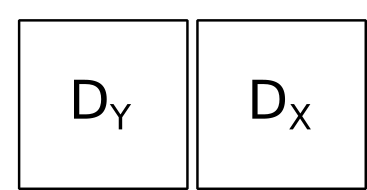

```{r setup, include=FALSE}
options(htmltools.dir.version = FALSE)
knitr::opts_chunk$set(tidy=TRUE, tidy.opts=list(width.cutoff=50), fig.height= 4, fig.width=4, dev='svg', fig.align="center", fig.path = "fig/")
```

```{r xaringan-themer, include=FALSE}
library(xaringanthemer)
style_duo(primary_color = "#1F4257", secondary_color = "#F97B64", table_row_even_background_color = "#1F4257")
```

---
class:
# Introduction
```{r 01intro, message = FALSE, size="tiny"}
library(ade4)
library(adegraphics)
adegpar(paxes.draw = TRUE,
  pbackground.col = 'lightgrey', pgrid.col = 'white')
data(yanomama)
str(yanomama, max.level = 1)
```
Differences among 19 Yanomama Indian villages, 3 distance matrices:

* Geographic

* Genetic

* Anthropometric

---

# Introduction
.pull-left[


One distance matrix measured on *n* individuals

]
.pull-right[
Describe the information contained in the table:

* Identify the differences/similarities between individuals
]

---
# Introduction
.pull-left[




Two distance matrices measured on *n* individuals

]
.pull-right[
Describe the information contained in the two table:

* Identify the differences/similarities between individuals in each table

* Indentify relationships between both matrices
]

---
# Why distances?

* Biological or ecological hypothesis can be defined using distances

* From spatial, genetic, phylogenetic, ecological data, etc.

* Distances can be directly measurued

* Distances can be computed from raw data
	- binary
	- numeric
	- percentage
	- factor
	- etc.

* Own definition of differences between individuals. 
---

## Dissimilarity  and distances

Let $E$ be a set of $n$ individuals. Let $x, y, z$ be 3 elements of $E$

A **dissimilarity** is an application $d: E \times E \rightarrow \mathbb{R}^{+}$ satisfying

(1) :  $\mathrm{d}\left( {x,y} \right)\geq 0$

(2) : $\mathrm{d}\left( {x,y} \right)=0\Rightarrow x=y$

(3) : $\mathrm{d}\left( {x,y} \right)=d\left( {y,x} \right)$

The dissimilarity is **metric** (a.k.a **distance**) if the following condition is satisfied

(4) : $\mathrm{d}\left( {x,y} \right)\leq \mathrm{d}\left( {x,z} \right)+\mathrm{d}\left( {z,y}\right)$

It is **ultrametric** if 

(4) : $\mathrm{d}\left( {x,y} \right)\leq max(\mathrm{d}\left( {x,z} \right),\mathrm{d}\left( {z,y}\right))$


It is euclidean if we can define $n$ points in an Euclidean space so that distances computed are exactly the dissimilarities.

---

## Methods based on distance matrices

in R, objects of class `dist`

* ultrametric $\rightarrow$ clustering / classification  

* euclidean $\rightarrow$ Principal Coordinates Analysis (PCoA)

* non-euclidean $\rightarrow$ Non-Metric Multidimensional Scaling (NMDS)

---

## Principal coordinates analysis

* PCA, CA methods induce implicitly a way to compute distances
* Several other distances have been proposed (e.g., genetic, presence-absence) 
* PCoA takes a distance matrix as input and returns coordinates in a low dimensional space that best preserve the original distances.


* `r emo::ji("smile")`  it allows to choose a particular distance measure between sites (or species). 
* `r emo::ji("sad_but_relieved_face")`  it focuses either on individuals or variables, not both.

* Useful if distances are directly recorded or computed from raw data tables

---
## PCoA algorithm

PCoA is based on the diagonalization of a bicentered matrix of squared distances.

$${\rm {\bf H}} =\left[ {-\frac{1}{2}d_{ij}^2 -m_i -m_j +m}
\right]$$

$${\rm {\bf H}} = {\rm {\bf U}}\Lambda {\rm {\bf U}}^t={\rm {\bf
U}}\Lambda ^{\frac{1}{2}}\Lambda ^{\frac{1}{2}}{\rm {\bf U}}^t={\rm {\bf
XX}}^t$$

---
## What about non-euclidean distances

```{r}
geo <- as.dist(yanomama$geo)
is.euclid(geo)
```

In this case, PCoA would returns negative eigenvalues as no euclidean representation is possible to preserves exactly the distances.

Some solutions:

* `cailliez` / `lingoes` : add constant values to distances

* `quasieuclid` : modify distances for quasi-euclidean distances

* NMDS : aims to preserve orders of distances (`vegan::metaMDS`)
---

## PCoA in practice

```{r}
geo <- quasieuclid(geo)
pco.geo <- dudi.pco(geo, scan = F)
s.label(pco.geo$li, plabel.optim = TRUE)

```

---

## Relationships among distance matrices

Is there a link between spatial distances and allelic distances ?

```{r}
plot(yanomama$gen ~ yanomama$geo, pch=15)
```

---
## Mantel test

Permutation-based testing procedure based on linear correlation (Pearson's). Can be monotonic (not only linear) if Spearman's correlation is used:

.pull-left[

```{r}
gen <- quasieuclid(as.dist(yanomama$gen))
m1 <- mantel.randtest(gen, geo)
m1
```
]

.pull-right[
```{r}
plot(m1)
```

]


---

## Comparing two configurations


```{r}
pco.gen <- dudi.pco(gen, scan = F)
```

.pull-left[
```{r}
s.label(pco.geo$li, plabel.optim = TRUE)
```

]
.pull-right[
```{r}
s.label(pco.gen$li, plabel.optim = TRUE)

```

]

---

## Fit the configurations of points

```{r}
s.match(pco.geo$li, pco.gen$li, plabel.optim = TRUE)

```

---


## Rotate, reflect

```{r}
coi <- coinertia(pco.geo, pco.gen, scannf= FALSE)
plot(coi)
```

---

## RV coefficient

```{r}
RV.randtest(pco.geo$li, pco.gen$li)
```

---

