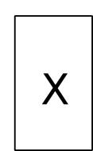
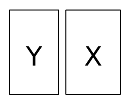
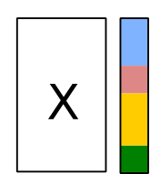
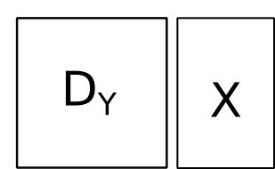
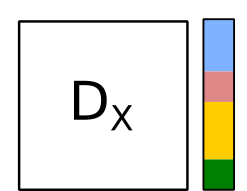
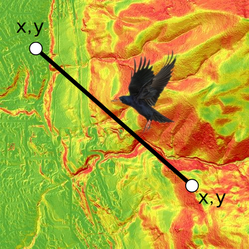

```{r setup, include=FALSE}
options(htmltools.dir.version = FALSE, width = 72)
knitr::opts_chunk$set(tidy=TRUE, tidy.opts=list(width.cutoff=50), fig.height= 4, fig.width=4, dev='svg', fig.align="center", fig.path = "fig/")
```

```{r correction, include = FALSE}
res.correction <- ifelse(params$correction, "markup", "hide")
```

```{r xaringan-themer, include=FALSE}
library(xaringanthemer)
duo(primary_color = "#1F4257", secondary_color = "#F97B64")
```

```{r include = FALSE}
library(knitr)
hook_output <- knit_hooks$get("output")
knit_hooks$set(output = function(x, options) {
  lines <- options$output.lines
  if (is.null(lines)) {
    return(hook_output(x, options))  # pass to default hook
  }
  x <- unlist(strsplit(x, "\n"))
  more <- "..."
  if (length(lines)==1) {        # first n lines
    if (length(x) > lines) {
      # truncate the output, but add.
      x <- c(head(x, lines), more)
    }
  } else {
    x <- c(more, x[lines], more)
  }
  # paste these lines together
  x <- paste(c(x, ""), collapse = "\n")
  hook_output(x, options)
})
``` 
$$\newcommand{\tr}{\hspace{-0.05cm}^{\top}\hspace{-0.05cm}} % transpose d'une matrice$$

$$\newcommand{\mb}[1]{\mathbf{#1}}$$

$$\newcommand{\sqnorm}[2]{
 \left \|  #1  \right \|^2_{#2}
}$$

$$\newcommand{\norm}[2]{
 \left \| #1 \right \|_{#2}
}$$


---
## Raw data

.column-left[
.center[


#### Principal Component Analysis

]
]

.column-center[
.center[

#### Co-Inertia Analysis

]
]
.column-right[
.center[


#### Between-Class Analysis


]
]

---
## Distances

.column-left[
.center[

```{r echo=FALSE, out.height="80%"}
knitr::include_graphics("img/DX.png")
```
#### Principal Coordinates Analysis

]
]

.column-center[
.center[
```{r echo=FALSE, out.height="80%"}

```
#### Distance-Based Redundancy Analysis
<br>
```{r echo=FALSE, out.height="80%"}
knitr::include_graphics("img/DYDX.png")
```
#### Mantel test
]
]
.column-right[
.center[

```{r echo=FALSE, out.height="80%"}

```
#### dbRDA, ANOSIM


]
]

---
## Distance vs Raw
- Distances can be directly measured or inherited from raw-data
.pull-left[
```{r echo=FALSE, out.height="50%", out.width="50%"}

```
]
.pull-right[
```{r echo=FALSE, out.height="80%", out.width="80%"}

```
]
---
## Distance vs Raw
- Raw-data methods produce information on both individuals and variables when distance-based methods focus only on individuals
```{r, message = FALSE}
library(ade4)
library(adegraphics)
data(doubs)
pca <- dudi.pca(doubs$env, scannf = FALSE)
pco <- dudi.pco(dist(scale(doubs$env)), scannf = FALSE)
```
.pull-left[
```{r, message = FALSE, out.width="60%"}
scatter(pca, main = "PCA")
```
]

.pull-left[
```{r, message = FALSE, out.width="60%"}
scatter(pco, main = "PCO")
```
]
---
## Distance vs Raw
- Distance-based methods allow for more flexibility and can be more suitable in some contexts
```{r, echo = FALSE}
x <- matrix(0, 4, 4)
x[, 4] <- 1
x[3:4, 3] <- 1
x[c(1,3), 1:2] <- 1
rownames(x) <- paste("site", 1:4)
colnames(x) <- paste("species", 1:4)
```

```{r}
x
```

.pull-left[
```{r}
## Euclidean
round(dist(x), 2) 
```
]
.pull-right[
```{r}
## Jaccard
round(dist.binary(x, method = 1), 2) 
```
]

Sites 3-4 are closer than sites 1-2 when considering only presences as a measure of similarity
---
## Distance vs Raw
- In some cases, both approaches can be equivalent (Euclidean distances)

For the univariate case, Euclidean distance is $d_{ij}=\sqrt{(x_i-x_j)^2}$ and we have:


$$var(\mathbf{x}) = \frac{1}{n}\sum_{i=1}^{n}{(x_i-\bar{x})^2}=\frac{1}{2n^2}\sum_{i=1}^{n}\sum_{j=1}^{n}{d_{ij}^2}$$
```{r}
x <- rnorm(10)
var(x) * 9 / 10
sum(as.matrix(dist(x))^2) / (2 * 10^2)
```

When using Euclidean distance, several raw- and distance-based analysis would produce the same results. 
---
## Your turn
1. Create an Rmd file
2. Load the `meaudret` data set from `ade4`
3. Perform the principal component analysis (`dudi.pca`) and principal coordinates analysis (`dudi.pco`) using Euclidean distances (`dist`) on faunistic data. Compare the outputs and conclude.
4. Transform the data into presence-absence (`ifelse(meaudret$spe>0, 1, 0)`). Peform principal coordinates analysis (`dudi.pco`) using Euclidean (`dist`) and Jaccard distances (`dist.binary`). Compare the results.
5. Perform the between-class analysis (`bca`) and distance-based RDA (`vegan::dbrda`) using Euclidean distances using the factor `meaudret$design$season` as an exploratory variable. Compare the results (be aware that `vegan` use $\frac{1}{n-1}$ to compute variances while `ade4` uses $\frac{1}{n}$).
6. Look at the percentage of variation explained by the between-class analysis (stored in the object). Perform permutational multivariate analysis of variance with the function `vegan::adonis` using the Euclidean distances. Compare

---
## Summary

When using Euclidean distances, we have:
<br><br>
- Principal Coordinates Analysis <span style="color:#F97B64"> $\Leftrightarrow$ </span>   Principal Component Analysis
<br><br>
- Distance-based Redundancy Analysis <span style="color:#F97B64"> $\Leftrightarrow$ </span> Redundancy Analysis (Between-Class Analysis when a single factor is used as explanatory variable)
<br><br>
- Permutational Distance-based Multivariate Analysis of Variance <span style="color:#F97B64"> $\Leftrightarrow$ </span> Permutation test of Between-Class Analysis
---
```{r, eval = FALSE, include = params$correction, echo = params$correction, results=res.correction}
## Answer 2
library(ade4)
library(adegraphics)
data(meaudret)
## Answer 3
pca.meau <- dudi.pca(meaudret$spe, scale = FALSE, scannf = FALSE)
pco.meau <- dudi.pco(dist(meaudret$spe), scannf = FALSE)
pca.meau$eig - pco.meau$eig ## Equivalence between the two analyses
## Answer 4
meau01 <- ifelse(meaudret$spe>0, 1, 0)
pco.meau1 <- dudi.pco(dist(meau01), scannf = FALSE)  
pco.meau2 <- dudi.pco(dist.binary(meau01, method = 1), scannf = FALSE)
cbindADEg(s.class(pco.meau1$li, meaudret$design$season, col = TRUE), s.class(pco.meau2$li, meaudret$design$season, col = TRUE))
## Answer 5
bca1 <- bca(pco.meau, meaudret$design$season, scannf = FALSE)
dbrda1 <- vegan::dbrda(dist(meaudret$spe)~meaudret$design$season)
dbrda1$CCA$eig * (nrow(meaudret$spe) - 1) / nrow(meaudret$spe) - bca1$eig ## Equivalence between the two analyses
## Answer 6
vegan::adonis(dist(meaudret$spe)~meaudret$design$season)
randtest(bca1)
```
